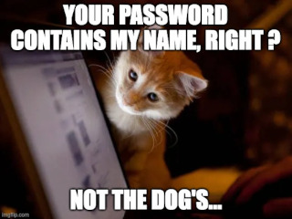

+++
title = 'MFA'
date = 2024-12-19T10:00:00-07:00
draft = false
tags = ['security', 'authentication', 'mfa']
toc = false
summary = 'What MFA is, why it matters, and how it works—in plain language.'
+++

# Multi-Factor Authentication

---

## What is Authentication?

Before we dive into MFA, let's start with the basics:
**authentication** is simply the process of proving that you are who you say you are.

Real life examples:

- Showing your ID at the airport
- Using a key to unlock your front door
- Spy peak in movies

When you log into a website or app, you're authenticating yourself.
The most common way to do this is with a **username and password**.

- You enter your username (which identifies you)
- You enter your password (which proves it's really you).

## The 3 Types of Authentication Factors

To understand MFA, you need to know about the three types of "factors" that can prove your identity:

### 1. Something You Know

This is information that only you should know. Examples include:

- Your password / A PIN code

### 2. Something You Have

This is a physical object that you possess. Examples include:

- Your smartphone / A USB security key / A bank card

### 3. Something You Are

This is a unique physical characteristic of your body. Examples include:

- Your fingerprint / Your face (facial recognition) / Your iris

## What is Multi-Factor Authentication (MFA)?

### The issue with simple login password

Passwords can be stolen, guessed, or hacked. That's where Multi-Factor Authentication comes in.

### Multi-Factor Authentication definition

Multi-Factor Authentication (MFA) means using _more than one_ of these factors.

Instead of just using a password (something you know), you combine it with something else:

- Like a code sent to your phone (something you have)
- Or your fingerprint (something you are).

### Why Should You Use MFA?

Even if someone gets your password, they still can't get in without the other security measure.

## Different Types of MFA

Here are the most common types of MFA you'll encounter:

### 1. SMS/Text Message Codes

**How it works:** After entering your password, you receive a text message with a code that you must enter to complete login.

- **Pros:** Simple and familiar—most people have a phone.
- **Cons:** Less secure than other methods (phone numbers can be hijacked).

### 2. Authenticator Apps

**How it works:** You install an app (like Google Authenticator, Microsoft Authenticator, or Authy) on your phone.
The app generates time-based codes that change every 30 seconds. You enter this code along with your password.

- **Pros:** More secure than SMS, works even without cell service.
- **Cons:** Requires a smartphone and the app must be set up initially.

### 3. Push Notifications

**How it works:** Instead of entering a code, you receive a notification on your phone asking "Did you try to log in?"

- **Pros:** Very user-friendly—no codes to type.
- **Cons:** Requires an internet connection and a smartphone.

### 4. Security Keys (my favorite)

**How it works:** You plug a small USB device (or tap it to your phone) when logging in. The device proves your identity (like your home keys).

- **Pros:** Extremely secure—very difficult to hack. (physhing resistant)
- **Cons:** You need to carry the physical device with you, and it costs money.

### 5. Biometrics

**How it works:** You use your fingerprint, face, or voice to authenticate. Many smartphones already use this for unlocking.

- **Pros:** Convenient—no codes to remember or devices to carry.
- **Cons:** Can be less secure if the biometric data is compromised (you can't change your fingerprint like you can change a password).

## What MFA protects you from

- **Stolen passwords:** Even if someone steals your password, they can't log in without your phone or other factor.
- **Phishing attacks:** Scammers who trick you into giving your password still can't access your account.
- **Data breaches:** If a company's password database is hacked, your account remains protected.

## What MFA doesn't protect you from

- **Advanced phishing:** An attacker can mimic a known website and trick you into entering your password and MFA code.
- The impact is limited: they only have access for the duration of that session.

## Conclusion

Multi-Factor Authentication might seem like extra work, but it's one of the best ways to protect your online accounts.
